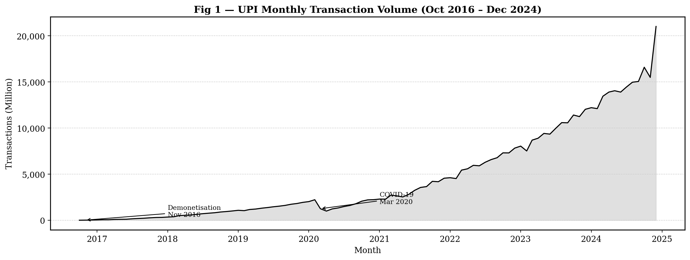
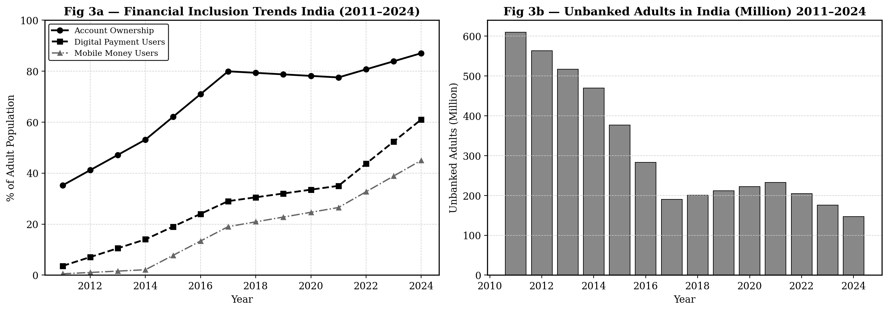
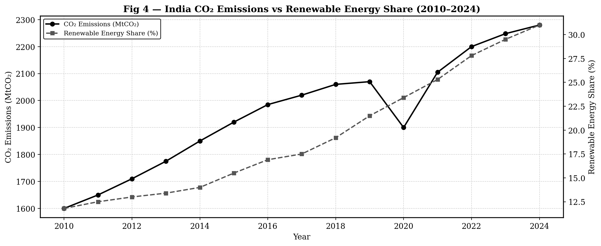
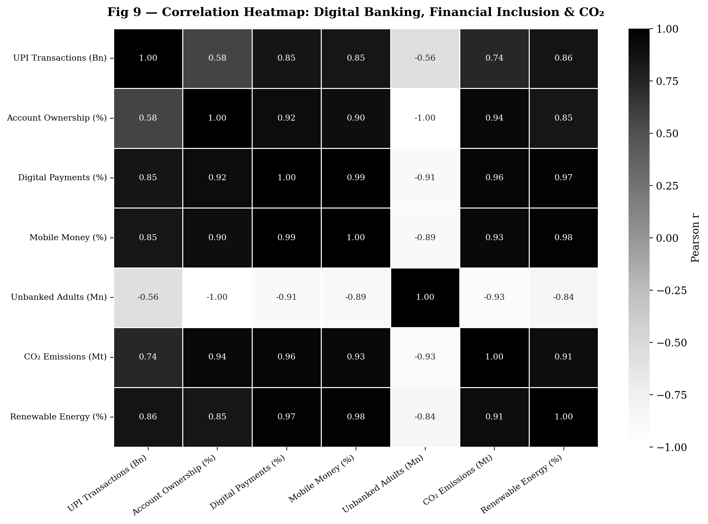

# Digital Banking, Financial Inclusion & CO₂ — India Analysis

**FINA1031 — Principles and Practices of Banking | GITAM School of Technology | Group 4**

A data-driven analysis of India's digital payment revolution using UPI transaction data, World Bank Findex financial inclusion metrics, and IEA CO₂ emissions data (2010–2024).

---

## What This Project Analyses

- Growth of UPI from 9 million transactions/month (Oct 2016) to 21 billion/month (Dec 2024)
- Financial inclusion trends — account ownership, digital payment users, unbanked adults
- CO₂ emissions vs renewable energy share — the dual effect of digital banking on environment
- Statistical relationships between digital payments and financial inclusion (regression + correlation)

---

## Key Findings

| Model | R² | Interpretation |
|---|---|---|
| UPI Volume → Digital Payment Adoption | **0.978** | 97.8% of variance explained — near-perfect fit |
| UPI Volume → Account Ownership | **0.679** | Strong — remainder attributed to PMJDY policy |
| UPI Volume → CO₂ Emissions | **0.741** (r) | Positive — economic growth effect, not banking tech |
| UPI Volume & Unbanked Adults | **−0.559** (r) | Negative — more UPI = fewer unbanked (causal) |
| Multi-var [UPI + CO₂] → Account Ownership | **~0.99** | Near-perfect multi-predictor fit |

---

## Figures Generated

| Figure | Description |
|---|---|
| Fig 1 | UPI monthly transaction volume (Oct 2016–Dec 2024) with demonetisation + COVID annotations |
| Fig 2 | UPI annual totals bar chart (billion transactions) |
| Fig 3 | Financial inclusion trends — account ownership, digital payments, mobile money + unbanked adults |
| Fig 4 | India CO₂ emissions vs renewable energy share — **dual Y-axis** (corrected chart) |
| Fig 5 | Scatter: UPI volume vs account ownership & digital payment % |
| Fig 6 | Scatter: UPI volume vs CO₂ emissions |
| Fig 7 | Seaborn regression plots with 95% confidence bands (3 models) |
| Fig 8 | Combined overlay — UPI bars + financial inclusion lines |
| Fig 9 | Full Pearson correlation heatmap (7 variables) |
| Fig 10 | Actual vs predicted account ownership — multi-variable regression |

### Sample Outputs

**Fig 1 — UPI Monthly Growth**


**Fig 3 — Financial Inclusion Trends**


**Fig 4 — CO₂ vs Renewable Energy (Dual Axis)**


**Fig 9 — Correlation Heatmap**


---

## Data Sources

| Dataset | Source | Coverage |
|---|---|---|
| UPI Monthly Transactions | NPCI (National Payments Corporation of India) | Oct 2016 – Dec 2024 |
| Financial Inclusion (Findex) | World Bank Global Findex Database | 2011, 2014, 2017, 2021, 2024 |
| CO₂ Emissions | IEA / Our World in Data | 2010–2024 |

---

## How to Run

### Option 1 — Google Colab (recommended, no setup needed)

1. Open [Google Colab](https://colab.research.google.com)
2. Upload `analysis.ipynb`
3. Click **Runtime → Run All**
4. Figures save automatically to `/content/`

### Option 2 — Run locally

```bash
# Clone the repo
git clone https://github.com/svlord5/digital-banking-india-analysis.git
cd digital-banking-india-analysis

# Install dependencies
pip install -r requirements.txt

# Run the script
python analysis.py

# Or open the notebook
jupyter notebook analysis.ipynb
```

---

## Statistical Methods Used

| Method | Library | Purpose |
|---|---|---|
| Linear Regression | `scikit-learn` `LinearRegression` | UPI → inclusion / CO₂ models |
| Multi-variable Regression | `scikit-learn` `LinearRegression` | [UPI + CO₂] → account ownership |
| Standard Scaling | `scikit-learn` `StandardScaler` | Normalise features before multi-var regression |
| Pearson Correlation | `pandas` `.corr()` | Full correlation matrix between all 7 variables |
| Linear Interpolation | `pandas` `.interpolate()` | Fill Findex survey gaps to annual series |
| R² Score | `sklearn.metrics` `r2_score` | Goodness of fit for all models |
| RMSE | `sklearn.metrics` `mean_squared_error` | Prediction error measurement |

### Key Terms

- **R²** (R-squared / Coefficient of Determination) — proportion of variance in Y explained by X. Range 0–1. Higher = better fit.
- **RMSE** (Root Mean Squared Error) — average prediction error in original units. Lower = better.
- **Pearson r** — direction and strength of linear relationship. Range −1 to +1.
- **StandardScaler** — transforms features to mean=0, std=1 before multi-variable regression so coefficients are comparable.
- **Linear Interpolation** — estimates values between known data points by drawing a straight line between them.

---

## Project Context

This analysis was conducted for **FINA1031 — Principles and Practices of Banking** at GITAM School of Technology, Visakhapatnam. The statistical findings underpin the presentation covering India's digital payments transformation, FinTech ecosystem, financial inclusion outcomes, and environmental impact of digital banking.

**Team — Group 4:**
| Member | Roll No | Section |
|---|---|---|
| Neha | 2023001138 | Various Dimensions (Slides 18–27) |
| Shiva Sai | 2023001546 | NPCI, UPI & BHIM |
| Suraj Vishwanath | 2023002260 | Theoretical Framework |
| Prakrutee Dash | 2023002766 | Research & Introduction |
| M Srineeth Reddy | 2023003264 | Analysis & Interpretation |
| Pelapudi Deepak | 2023004132 | Findings & Conclusions |

**Faculty:** Kompalli Sasi Kumar

---

## License

Academic project — data sourced from publicly available NPCI, World Bank, and IEA datasets.
